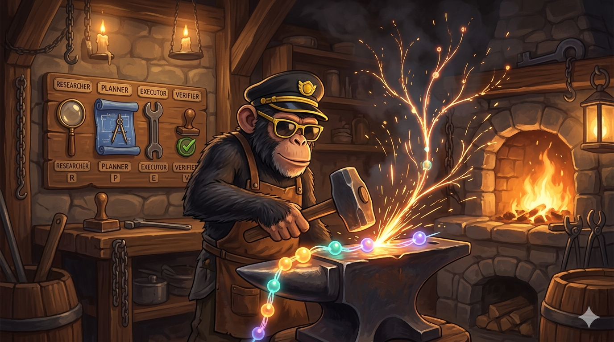

<p align="center">
  
</p>

<h1 align="center">The Forge Flow</h1>

<p align="center">
  Autonomous coding agent orchestrator for Claude Code.<br/>
  Dual markdown+beads state. Plannotator reviews. Wave-based parallel execution.
</p>

<p align="center">
  <a href="#setup-guide">Setup</a> |
  <a href="#full-workflow-example">Workflow</a> |
  <a href="#commands">Commands</a> |
  <a href="#architecture">Architecture</a> |
  <a href="#agents">Agents</a>
</p>

---

## What is The Forge Flow?

The Forge Flow (`tff`) is a Claude Code plugin that orchestrates AI agents through a structured software development lifecycle. It coordinates 13 specialized agents from project initialization to shipped code.

**Key features:**
- **Dual state** -- markdown files for human-readable content, beads for status/dependencies
- **Wave-based execution** -- tasks are topologically sorted into waves, independent tasks run in parallel
- **Fresh reviewer enforcement** -- code reviewers are never the same agent that wrote the code
- **Plannotator integration** -- all plan reviews, verification, and code reviews go through plannotator's interactive UI
- **Complexity tiers** -- S (quick fix), F-lite (feature), F-full (complex) determine which phases are required
- **Checkpoint/resumability** -- pause and resume execution across sessions
- **Skill library** -- reusable knowledge fragments with token-budget tiers that agents load for consistent practices
- **Autonomous flow** -- `plan-to-pr` mode auto-runs from plan approval through PR creation, with escalation on failure
- **Auto-learn pipeline** -- observes tool-use patterns, ranks candidates, drafts skills with bounded guardrails
- **Agent personality** -- each agent has distinct methodology, communication style, and domain expertise

---

## Setup Guide

The Forge Flow is built on three pillars: **beads** (AI-native issue tracker), **Dolt** (version-controlled database), and **plannotator** (interactive review UI). While tff can run in a degraded markdown-only mode without beads, you'll lose the features that make it powerful: atomic task claiming, dependency-aware wave parallelism, team state sync, and `bd ready` ("what should I work on next?"). **Install all three for the full experience.**

### Step 1: Install Dolt

Beads uses [Dolt](https://www.dolthub.com/), a version-controlled SQL database, as its storage backend.

**macOS:**
```bash
brew install dolt
```

**Linux:**
```bash
sudo bash -c 'curl -L https://github.com/dolthub/dolt/releases/latest/download/install.sh | bash'
```

**Windows:**
```powershell
choco install dolt
```

Verify: `dolt version`

### Step 2: Install beads CLI

```bash
npm install -g @beads/bd
```

Verify: `bd --version`

**Initialize beads in your project** (done automatically by `/tff:new`, but you can do it manually):

```bash
cd your-project
bd init
```

This creates a `.beads/` directory with a Dolt database.

**Recommended: Run Dolt as a persistent server.** Beads auto-starts Dolt on each command, but the ephemeral server can be slow and flaky. For a reliable experience, start Dolt in a separate terminal:

```bash
cd your-project
dolt sql-server --port=3306
```

Leave it running while you work. Beads will connect to the existing server instead of auto-starting.

If you see connection warnings, run:

```bash
bd doctor --fix
```

### Step 3: Install plannotator

Plannotator is a Claude Code plugin that provides an interactive browser UI for reviewing plans and code.

```bash
# Add the plannotator marketplace
claude /plugin marketplace add backnotprop/plannotator

# Install the plugin
claude /plugin install plannotator@plannotator
```

Verify: Run `/plannotator-review` in Claude Code -- it should open a browser window.

### Step 4: Install The Forge Flow

```bash
# Add the marketplace
claude /plugin marketplace add MonsieurBarti/The-Forge-Flow-CC

# Install the plugin
claude /plugin install the-forge-flow@the-forge-flow
```

Verify: Run `/tff:help` in Claude Code to see the command reference.

### Verification

Run `/tff:health` to check all dependencies are correctly installed. It will report the status of beads, plannotator, and state consistency.

---

## Full Workflow Example

Here's a complete walkthrough from empty project to shipped milestone: building an authentication system.

### 1. Initialize the project

```
/tff:new
```

Claude asks for your project name and vision. You provide:
- **Name:** my-saas-app
- **Vision:** A multi-tenant SaaS platform with team management

This creates `.tff/PROJECT.md`, initializes beads, and asks you to define requirements.

**Next step suggested:** `/tff:new-milestone`

### 2. Create a milestone

```
/tff:new-milestone
```

- **Name:** MVP
- **Goal:** Basic auth + team CRUD

This creates the `milestone/M01` branch and prompts you to break the milestone into slices.

You define 3 slices:
1. **Auth flow** -- signup, login, JWT tokens
2. **Team CRUD** -- create/read/update/delete teams
3. **Permissions** -- role-based access control

**Next step suggested:** `/tff:discuss`

### 3. Discuss the first slice

```
/tff:discuss
```

The **brainstormer** agent (opus) challenges your assumptions:
- "What OAuth providers do you need? Just email/password?"
- "How do JWT tokens refresh? What's the expiry strategy?"
- "Is email verification required for MVP?"

The **product-lead** agent validates requirements and defines acceptance criteria.

Complexity is auto-classified as **F-lite** (5 tasks, 2 modules, no external integrations).

**Next step suggested:** `/tff:research M01-S01`

### 4. Research (optional for F-lite)

```
/tff:research M01-S01
```

The agent investigates the technical approach: reads the existing codebase, checks what auth libraries are available, documents findings in `.tff/milestones/M01/slices/M01-S01/RESEARCH.md`.

**Next step suggested:** `/tff:plan M01-S01`

### 5. Plan the slice

```
/tff:plan M01-S01
```

The agent creates a task decomposition with dependencies:
- T01: User entity + migration (no deps)
- T02: Password hashing service (no deps)
- T03: Signup endpoint (depends on T01, T02)
- T04: Login endpoint (depends on T01, T02)
- T05: JWT middleware (depends on T04)

Waves detected:
- Wave 0: [T01, T02] -- parallel
- Wave 1: [T03, T04] -- parallel
- Wave 2: [T05] -- sequential

**Plannotator opens** in your browser. You annotate the plan, suggest changes, approve.

A worktree is created at `.tff/worktrees/M01-S01/` on branch `slice/M01-S01`.

**Next step suggested:** `/tff:execute M01-S01`

### 6. Execute with wave parallelism

```
/tff:execute M01-S01
```

For each wave:

**Wave 0:** The **tester** agent writes failing specs for T01 and T02. Then **backend-dev** agents are spawned in parallel -- one for T01 (user entity), one for T02 (password hashing). Each implements until tests pass, then commits atomically.

**Wave 1:** Same pattern for T03 and T04. Tests written first, then implementation.

**Wave 2:** T05 (JWT middleware) -- sequential, single agent.

Checkpoints are saved after each wave. If the session crashes, `/tff:resume` picks up where it left off.

**Next step suggested:** `/tff:verify M01-S01`

### 7. Verify acceptance criteria

```
/tff:verify M01-S01
```

The **product-lead** agent checks each acceptance criterion against the implementation. Results are written to `VERIFICATION.md`.

**Plannotator opens** for you to review the findings. You mark any issues.

If all pass: **Next step suggested:** `/tff:ship M01-S01`
If failures: suggests `/tff:execute M01-S01` to fix and re-run.

### 8. Ship the slice (two-stage review)

```
/tff:ship M01-S01
```

**Stage 1 -- Spec compliance:** The **spec-reviewer** agent (fresh, never wrote this code) verifies every acceptance criterion is met in the actual code.

**Stage 2 -- Code quality:** The **code-reviewer** agent checks quality, patterns, tests, YAGNI. Only runs after spec passes.

**Security audit:** The **security-auditor** agent checks for OWASP top 10 issues.

**Plannotator opens** for your final code review.

If approved: slice PR is created (`slice/M01-S01` -> `milestone/M01`), merged, worktree cleaned up.

**Next step suggested:** `/tff:discuss` (for the next slice) or `/tff:progress`

### 9. Repeat for remaining slices

Run the same cycle for M01-S02 (Team CRUD) and M01-S03 (Permissions).

### 10. Complete the milestone

```
/tff:audit-milestone
```

Checks all slices are closed, requirements are covered. Then:

```
/tff:complete-milestone
```

Creates the milestone PR (`milestone/M01` -> `main`), runs a final security audit, opens plannotator for review. After approval, merges to main.

**Next step suggested:** `/tff:new-milestone` for the next milestone.

### Quick fixes and debugging

Found a bug while working on a later slice? Two options:

**If you know the fix:**
```
/tff:quick "Fix null pointer in user validation"
```
Skips brainstorming and research, goes straight to plan -> execute -> ship.

**If you need to investigate:**
```
/tff:debug "Users getting 500 on login after password reset"
```
Systematically diagnoses the issue first (no slice created), then fixes via S-tier slice once root cause is confirmed.

---

## Commands

### Project Lifecycle

| Command | Description |
|---|---|
| `/tff:new` | Initialize a new tff project |
| `/tff:new-milestone` | Start a new milestone |
| `/tff:progress` | Show status dashboard |
| `/tff:status` | Lightweight status with next step |

### Slice Lifecycle

| Command | Description |
|---|---|
| `/tff:discuss` | Brainstorm and scope a slice |
| `/tff:research [slice-id]` | Research phase |
| `/tff:plan [slice-id]` | Plan and create tasks |
| `/tff:execute [slice-id]` | Execute with wave parallelism |
| `/tff:verify [slice-id]` | Verify acceptance criteria |
| `/tff:ship [slice-id]` | PR review and merge slice |
| `/tff:quick <description>` | Fast-track S-tier changes |
| `/tff:debug <error or symptom>` | Diagnose and fix a bug systematically |

### Milestone Lifecycle

| Command | Description |
|---|---|
| `/tff:audit-milestone` | Audit against original intent |
| `/tff:complete-milestone` | PR review and merge to main |

### Management

| Command | Description |
|---|---|
| `/tff:add-slice` | Add slice to milestone |
| `/tff:insert-slice` | Insert between slices |
| `/tff:remove-slice` | Remove future slice |
| `/tff:rollback [slice-id]` | Revert slice commits |
| `/tff:pause` | Save checkpoint |
| `/tff:resume` | Restore from checkpoint |
| `/tff:sync` | Sync markdown and beads |
| `/tff:health` | Diagnose state consistency |
| `/tff:settings` | View and modify all project settings |
| `/tff:map-codebase` | Analyze codebase and generate docs |
| `/tff:help` | Show command reference |

### Skill Auto-Learn

| Command | Description |
|---|---|
| `/tff:detect-patterns` | Run pattern detection pipeline |
| `/tff:suggest-skills` | Show ranked skill candidates |
| `/tff:create-skill` | Draft skill from pattern or description |
| `/tff:learn` | Detect skill divergences and propose refinements |
| `/tff:compose` | Detect and bundle skill clusters |

## Architecture

```
the-forge-flow/
  .claude-plugin/         # CC marketplace manifest
  commands/tff/           # 30 slash commands (.md)
  agents/                 # 13 agent definitions (.md)
  skills/                 # 7 reusable knowledge skills (.md)
  workflows/              # 23 orchestration workflows (.md)
  references/             # 7 reference documents (.md)
  hooks/                  # PostToolUse observation hook (.sh)
  tools/
    src/
      domain/             # Hexagonal domain layer (Zod, Result<T,E>)
      application/        # Use cases (orchestrate domain via ports)
      infrastructure/     # Adapters (beads CLI, git CLI, filesystem)
      cli/                # tff-tools.cjs entry point
    dist/tff-tools.cjs    # Compiled single-file CLI bundle
```

### Hexagonal Rules

- **Domain** imports only Zod + `node:crypto`. No infrastructure.
- **Zod as single source of truth** -- `z.infer<typeof Schema>` everywhere, no TS `enum`.
- **Result\<T, E\>** for all fallible operations. Never throw.
- **Ports** define interfaces in domain. Adapters implement in infrastructure.
- **Tests** colocated as `.spec.ts`. Unit tests use in-memory adapters.

## Agents

| Agent | Role | Profile |
|---|---|---|
| brainstormer | Challenge assumptions, surface unknowns | quality (opus) |
| architect | Architecture decisions, module boundaries | quality (opus) |
| product-lead | Requirements validation, acceptance criteria | balanced (sonnet) |
| backend-dev | API, services, domain logic | budget (sonnet) |
| frontend-dev | UI code, components | budget (sonnet) |
| devops | CI/CD, infrastructure | budget (sonnet) |
| tester | Write failing tests before implementation | balanced (sonnet) |
| code-reviewer | Code quality review (fresh reviewer) | quality (opus) |
| spec-reviewer | Spec compliance verification | quality (opus) |
| security-auditor | Security review on every PR | quality (opus) |
| fixer | Apply accepted review findings | budget (sonnet) |
| doc-writer | Codebase documentation and analysis | budget (sonnet) |
| skill-drafter | Draft skills from observed patterns | quality (opus) |

## Skills

Skills are reusable knowledge fragments that agents load via `@skills/<name>.md`. They teach HOW to do something -- agents define WHO does it.

| Skill | Used By |
|---|---|
| hexagonal-architecture | backend-dev, frontend-dev, devops, architect, doc-writer |
| test-driven-development | tester, backend-dev, frontend-dev |
| code-review-checklist | code-reviewer, spec-reviewer, architect |
| commit-conventions | all executor agents, fixer |
| plannotator-usage | plan, verify, ship workflows |
| interactive-design | discuss workflow (conversation methodology, spec templates, reviewer prompts) |
| debugging-methodology | debug workflow (Track A: reproducible errors, Track B: symptom-based diagnosis) |

## Work Hierarchy

```
Project (one per repo)
  Milestone (M01, M02, ...)
    Slice (M01-S01, M01-S02, ...)
      Task (T01, T02, ...)
```

### Git Branch Model

```
main
  milestone/M01
    slice/M01-S01  (worktree)
    slice/M01-S02  (worktree)
```

### Complexity Tiers

| Tier | Brainstormer | Research | TDD | Fresh Reviewer |
|---|---|---|---|---|
| S (quick fix) | Skip | Skip | Skip | Always |
| F-lite (feature) | Yes | Optional | Yes | Always |
| F-full (complex) | Yes | Required | Yes | Always |

## Configuration

Project settings live in `.tff/settings.yaml`. Generated automatically by `/tff:new` with inline comments. Manage interactively with `/tff:settings`.

```yaml
model-profiles:
  quality:
    model: opus       # brainstormer, architect, code-reviewer, security-auditor
  balanced:
    model: sonnet     # product-lead, tester
  budget:
    model: sonnet     # frontend-dev, backend-dev, devops, fixer, doc-writer

autonomy:
  mode: guided        # "guided" (pause at every step) | "plan-to-pr" (auto-transition)

auto-learn:
  weights:
    frequency: 0.25
    breadth: 0.30
    recency: 0.25
    consistency: 0.20
  guardrails:
    min-corrections: 3
    cooldown-days: 7
    max-drift-pct: 20
  clustering:
    min-sessions: 3
    min-patterns: 2

# dolt:               # Uncomment after: dolt remote add origin <url>
#   remote: origin
#   auto-sync: true
```

Settings are resilient: corrupted or partial files fall back to defaults per field. Run `/tff:settings` to detect and add missing fields.

## License

MIT
